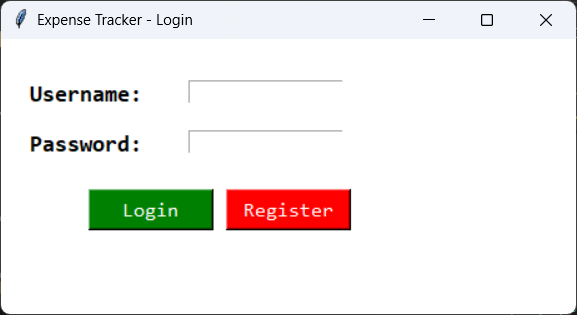
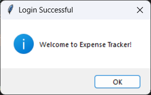
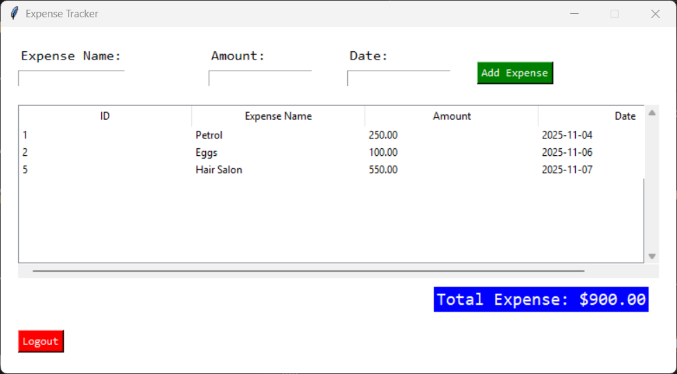
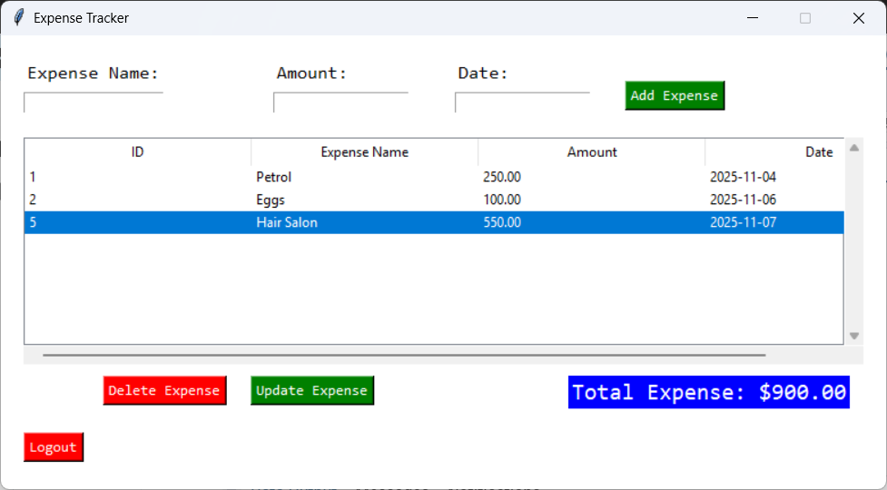

# Expense Tracker App using Python and MySQL.

An expense tracker is a tool that helps individuals or businesses log, categorize, and monitor their spending habits systematically. An expense tracker project in ***Python using Tkinter and MySQL database*** that is both user-friendly and robust, 
which can help users to manage their expenses with ease.

Combined Tkinter’s GUI capabilities and MySQL’s database management to create this application that can handle user authentication, add, edit, delete expenses, and display expenses report. So, grab your favorite cup of coffee and start building!

## 📸 Screenshot

